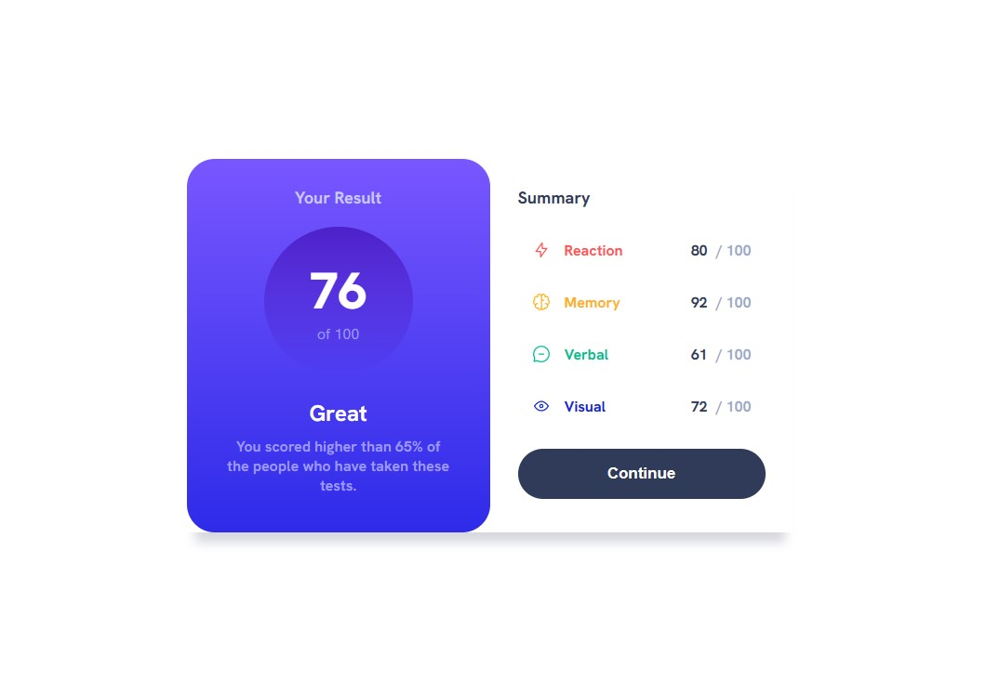
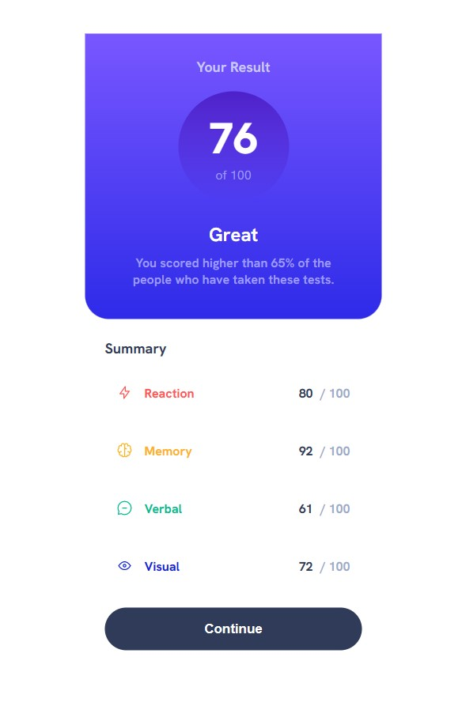

# Frontend Mentor - Results summary component solution

This is a solution to the [Results summary component challenge on Frontend Mentor](https://www.frontendmentor.io/challenges/results-summary-component-CE_K6s0maV). Frontend Mentor challenges help you improve your coding skills by building realistic projects. 

## Table of contents

- [Overview](#overview)
  - [The challenge](#the-challenge)
  - [Screenshot](#screenshot)
  - [Links](#links)
- [My process](#my-process)
  - [Built with](#built-with)
  - [What I learned](#what-i-learned)
  - [Continued development](#continued-development)
- [Author](#author)

## Overview

### The challenge

Users should be able to:

- View the optimal layout for the interface depending on their device's screen size
- See hover and focus states for all interactive elements on the page

### Screenshot

### Links
- Live Site URL:(https://makvalaa.github.io/Results-Summary-Component/)

## My process

### Built with

- Semantic HTML5 markup
- CSS custom properties
- Flexbox
- CSS Grid
- Mobile-first workflow
### What I learned

I learned how to use font-face media query for local font files, how to create gradients for background. I couldn't figure out how to center the grid both vertically and horizontally when it doesnt have fixed width, but after some digging I finally found answers.

### Continued development

I feel like my codes (both HTML and CSS) are very messy at the moment, and that sometimes I overcomplicate basic tasks when there's a much better and simpler solution.

## Author

- Frontend Mentor - [@makvalaa](https://www.frontendmentor.io/profile/Makvalaa)
